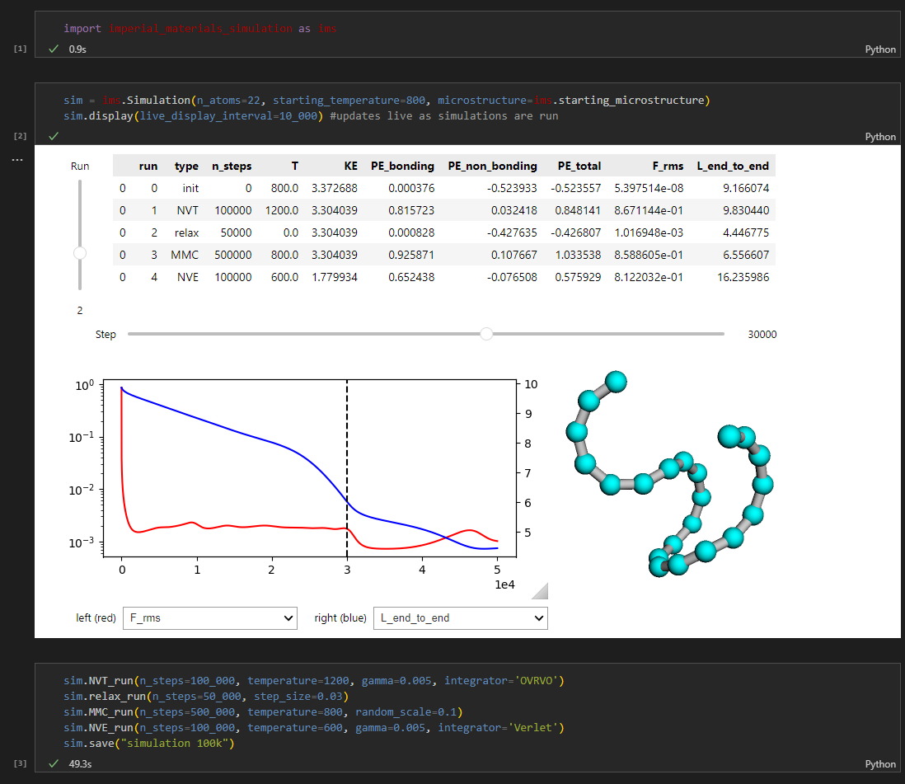
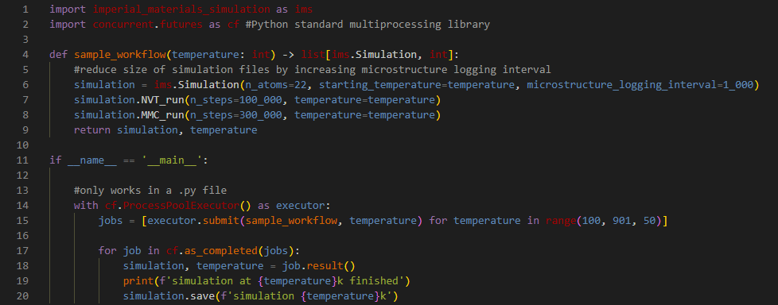

# Imperial Materials Simulation

Molecular simulation tool made for the theory and simulation module taken by materials science and engineering undergraduates at Imperial College London.

It models the forces acting on a molecule in different situations and displays the results live using an interactive Jupyter notebook dashboard.

## Method

Each polymer is a linear string of beads (CH2 units) with no side chains. Bonds are modelled as springs and long range interactions are modelled using a 12-6 Lennard-Jones potential.

Four methods of atomistic simulation are implemented: 

1. Steepest descent structural relaxation / energy minimization.

2. Constant temperature ('NVT') dynamics with a Langevin thermostat. 

3. Constant energy Hamiltonian ('NVE') molecular dynamics.

4. Metropolis Monte Carlo ('MMC') stochastic model.

For each time step, the forces and potentials of each atom are calculated. This allows for their positions and velocities to be updated following the given atomistic simluation method.

## Installation

This library can be installed from pypi:

    pip install imperial-materials-simulation

For developement use, the codebase can be cloned from GitHub:

    git clone https://github.com/AyhamSaffar/imperial-materials-simulation.git

Dependancies for developement use can optionally be installed using the dedicated conda enviroment:

    conda config --add channels conda-forge

    conda create --name sim_env --file conda_env.txt

## Usage

All examples shown can be found in the examples notebook.

All functionality and details are well documented in the doc-strings of the main Simulation class and its methods. 

*Minimal use*

*Data collection*

*Detailed Analysis*

## Support

Any issues with the library should be raised directly with Paul Tangney.

There is a known bug that sometimes makes the .display() method show a column of plots at once. This is being worked on, but for the moment can be fixed with a quick computer restart.

## Roadmap

The following features could be implemented down the road following popular demand:

- Replace MatPlotLib graphs in display with Plotly for a faster & more responsive dashboard (especially when its live updating during longer runs).

- Add run .xyz trajectory exporter for better integration with external software.

- Added support for charged functional groups on the simulated molecule and a VRORV integrator to better account for the added electrostatic forces.

- Add artist to run dataframe on dashboard so numbers are displayed in scientific format and the row for the current run gets highlighted.

## Authors and Acknowledgment

This program was written by me, Ayham Al-Saffar, based on Paul Tangney's initial codebase and was funded by an Imperial College London Student Shapers grant.